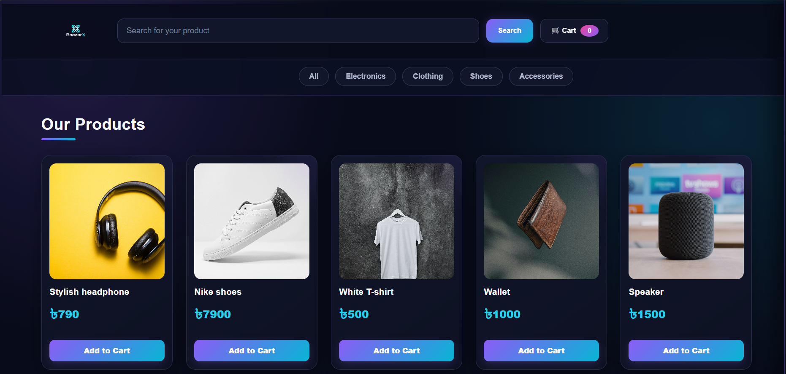

# 🛒 BaazarX

**BaazarX** is a modern, responsive mini e-commerce website built with **HTML, CSS, and JavaScript**.
The project focuses on practicing DOM manipulation, JavaScript arrays, events, filtering, searching, and dynamic UI rendering.

---

## 🚀 Live Demo

🔗 **Live Demo:** Coming Soon

---

## 📸 Preview



## ✨ Features

### 🛍️ Product Display

* Dynamic product rendering using JavaScript
* Product name, price, category, and image
* Responsive product card layout
* Modern dark neon UI

### 🔎 Product Search

* Search products by name
* Case-insensitive search
* Partial keyword matching
* Supports pressing **Enter** to search
* Displays an alert when no matching product is found

### 🗂️ Category Filtering

Products can be filtered by:

* All
* Electronics
* Clothing
* Shoes
* Accessories

### 🛒 Shopping Cart

* Add products to cart
* Prevents duplicate product entries
* Automatically increases quantity when an existing product is added
* Displays total number of items
* Increase product quantity using `+`
* Decrease quantity using `-`
* Remove products from cart
* Automatically calculates the total price

### 🎨 Modern UI

* Dark futuristic theme
* Neon purple, cyan, and pink accents
* Gradient buttons
* Product hover effects
* Glassmorphism-inspired elements
* Responsive layout for desktop, tablet, and mobile

---

## 🧠 Concepts Practiced

This project was built to strengthen practical JavaScript and frontend development skills.

### HTML

* Semantic HTML structure
* Forms and input fields
* Buttons
* `data-*` attributes
* Dynamic content containers

### CSS

* Flexbox
* CSS Grid
* Responsive design
* Media queries
* Gradients
* Hover effects
* Transitions
* Shadows and glow effects
* Sticky navigation
* Responsive sidebar

### JavaScript

* Arrays and objects
* Array methods

  * `forEach()`
  * `filter()`
  * `find()`
  * `findIndex()`
  * `push()`
  * `splice()`
* DOM manipulation
* Event listeners
* `dataset`
* Template literals
* Object spread syntax
* Conditional statements
* Dynamic element creation
* Search functionality
* Cart management

---

## 📁 Project Structure

```text
BaazarX/
│
├── index.html
├── Baazar.css
├── sript.js
│
├── BaazarX.jpg
├── headphone.jpg
├── shoes.jpg
├── tshirt.jpg
├── wallet.jpg
├── speaker.jpg
└── watch.jpg
```

---

## ⚙️ How to Run

1. Clone the repository:

```bash
git clone YOUR_REPOSITORY_URL
```

2. Open the project folder.

3. Open `index.html` in your browser.

That's it! No backend or external dependencies are required.

---

## 🛠️ Technologies Used

| Technology | Purpose                            |
| ---------- | ---------------------------------- |
| HTML5      | Website structure                  |
| CSS3       | Styling and responsive UI          |
| JavaScript | Functionality and DOM manipulation |

---

## 🔮 Future Improvements

The project is still under development. Planned features include:

* [ ] `localStorage` cart persistence
* [ ] Active category indicator
* [ ] Empty cart state
* [ ] Add-to-cart notifications
* [ ] Checkout system
* [ ] Order summary
* [ ] Product sorting
* [ ] Wishlist/favorites
* [ ] Improved mobile experience
* [ ] Backend integration
* [ ] User authentication
* [ ] Database integration
* [ ] Real product API

---

## 🎯 Learning Goal

BaazarX was created as a practical frontend project to move beyond basic HTML, CSS, and JavaScript tutorials and build a functional website from scratch.

The main goal is to understand how different frontend concepts work together to create an interactive e-commerce experience.

---

## 👨‍💻 Author

**Ashrafujjaman Rafi**

KUET CSE Student

Interested in:

* Software Engineering
* Web Development
* Competitive Programming
* Building real-world software projects

---

## 📌 Project Status

🟢 **Active Development**

More features and improvements are planned.

---

## ⭐ Support

If you find this project interesting, consider giving the repository a ⭐ on GitHub.
